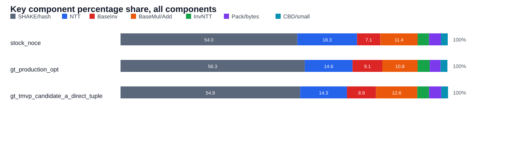

# GT KEM component profiler and small-input NTT note

Date: 2026-06-24
Latest update: 2026-06-25

This note is intentionally compact.  It covers only:

- `ntruplus-KpqC-Final/Additional_Implementation/aarch64/NTRU+768`
- `test_kem_gt_production_opt` / `profile_kem_gt_production_opt`
- `test_kem_gt_production_opt_baseline` / `profile_kem_gt_production_opt_baseline`
- `test_kem_gt_production_opt_rminus1` / `profile_kem_gt_production_opt_rminus1`
- `test_kem_gt_tmvp_candidate_a_direct_tuple`

## Profiler

Profiler source:

```text
gt_test/kem_component_profiler.c
```

Build:

```sh
make -B profile_kem_stock \
        profile_kem_stock_ce_local \
        profile_kem_gt_production_opt \
        profile_kem_gt_production_opt_baseline \
        profile_kem_gt_tmvp_candidate_a_direct_tuple
```

Run on Pi5:

```sh
taskset -c 3 ./build/profile_kem_stock
taskset -c 3 ./build/profile_kem_gt_production_opt
taskset -c 3 ./build/profile_kem_gt_production_opt_baseline
taskset -c 3 ./build/profile_kem_gt_tmvp_candidate_a_direct_tuple
```

Current decision baseline is Pi5 NO_CE.  The local M2 Pro profiler below is
kept only as historical same-machine data; do not use it for the current
Pi5 optimization decision.

Run on local MacBook Pro M2 Pro:

```sh
make -B profile_kem_m2pro_ce CC=cc
./build/profile_kem_m2pro_stock_ce
./build/profile_kem_m2pro_gt_production_opt_ce
./build/profile_kem_m2pro_gt_tmvp_candidate_a_direct_tuple_ce
```

Optional same-machine no-CE baseline:

```sh
make -B profile_kem_m2pro_stock_noce CC=cc
./build/profile_kem_m2pro_stock_noce
```

KPQC Final note:

```text
The KPQC Final Makefile defaults to CE/f1600.S, but this Pi5 assembler rejects
the SHA3-extension mnemonics eor3/rax1/xar/bcax.  The standard KEM table keeps
the earlier kpqc_final_aarch64_noce baseline.  The profiler table uses the
optimized folder's stock_noce target, built from the stock aarch64 poly/ASM
path plus portable NO_CE/fips202.c, so it is the same no-CE baseline class.
```

The profiler has four sections:

```text
KEM path totals
  deterministic no-reject replay, useful for rough path shape only

KEYGEN components
ENCAP components
DECAP components
  direct component timing grouped by KEM path
```

For component rows, `count` is the number of times the operation appears in that
path, `one` is the direct timing of one call, and `est_total = count * one`.

Historical same-harness KEM result from `test/test.c` before the production
rename:

```text
target                                      count  KEYGEN  ENCAP  DECAP
kpqc_final_aarch64_noce                         0     945    925    790
test_kem_gt_production_opt                      0     963    898    766
test_kem_gt_production_opt_rminus1              0     959    895    750
test_kem_gt_tmvp_candidate_a_direct_tuple       0     991    896    766
```

The Candidate A direct-tuple row above is after switching support routines back
to stock support ASM.  The previous Candidate A row with C support routines was
`1011 / 920 / 860`.

### 2026-06-25 latest production comparison

Pi5, NO_CE, current flat workspace.

Latest naming:

```text
gt_production_opt          = production rminus1 decap path
gt_production_opt_baseline = old non-rminus comparison path
gt_production_opt_rminus1  = explicit alias for the same rminus1 path
```

Standard KEM bench:

```text
target                                      KEYGEN  ENCAP  DECAP
kpqc_final_aarch64_noce                        945    922    799
gt_production_opt                              961    897    750
gt_production_opt_baseline                     963    896    766
gt_production_opt_rminus1                      961    898    750
gt_production_opt_add32                        960    897    766
gt_production_opt_tuple_decap                  959    896    772
gt_production_opt_add32_tuple_decap            961    897    771
gt_tmvp_candidate_a_direct_tuple               963    897    765
```

Against KPQC Final, latest production `gt_production_opt` is currently:

```text
KEYGEN: 945 -> 961,  16 ticks slower, about -1.7%
ENCAP:  922 -> 897,  25 ticks faster, about +2.7%
DECAP:  799 -> 750,  49 ticks faster, about +6.1%
```

Profiler path totals:

```text
target                                      keygen_derand  enc_derand  dec_valid
stock_noce                                           1025         878        790
gt_production_opt                                     913         853        751
gt_production_opt_baseline                            914         853        766
gt_production_opt_rminus1                             914         853        751
gt_production_opt_add32                               914         853        767
gt_production_opt_tuple_decap                         913         853        772
gt_production_opt_add32_tuple_decap                   913         852        772
gt_tmvp_candidate_a_direct_tuple                      914         851        766
```

Production recommendation:

```text
Use `gt_production_opt` as the current production GT variant.  It now means
the rminus1 decap path.

It is a decap-only representation optimization:
  poly_basemul_rminus1(&m1, &c, &f)
  poly_invntt_from_rminus1(&m1, &m1)

The public polynomial ABI is unchanged.  Only the private m1=c*f temporary
keeps one tracked Montgomery factor and the following inverse NTT absorbs it.
Correctness passed in the KEM profiler and test/test.c harness.
```

The important component delta is:

```text
gt_production_opt decap:
  poly_basemul_rminus1       45
  poly_invntt_from_rminus1   90
  poly_basemul               61

gt_production_opt_baseline decap:
  poly_basemul 2 * 62 = 124
  poly_invntt      90
```

So rminus1 saves the final Montgomery correction on exactly the first decap
product `m1=c*f`, reducing that product from about 62 ticks to 45 ticks.
It does not change keygen/encap and it is not a 20% whole-KEM win by itself.

### 2026-06-25 latest key component subtotals

Scope:

```text
These subtotals sum the profiler's estimated component totals across keygen,
encap, and decap.  They are not raw KEM wall-clock totals; they are meant to
show where the measured component time is spent.

kpqc_final_aarch64_noce uses the same stock no-CE AArch64 component class as
profile_kem_stock.

gt_production_opt is now the combined production route:
  GT_PRODUCTION_USE_SCALED_KEYPAIR + GT_PRODUCTION_USE_RMINUS1_DECAP

It also uses the Slothy support-kernel source:
  GT_SUPPORT_ASM = asm/slothy/support_kernels/support_kernels.n1.opt.S asm/cbd.s

candidate_a_direct_tuple still uses STOCK_SUPPORT_ASM in the Makefile, so its
pack/frombytes/crepmod3/add helper numbers should not be read as Slothy support
numbers yet.
```

Pi5 same-core KEM benchmark, `taskset -c 3`, NO_CE:

| target | count | KEYGEN | ENCAP | DECAP |
| --- | ---: | ---: | ---: | ---: |
| test_kem_stock | 0 | 946 | 922 | 791 |
| test_kem_gt_production_opt | 0 | 923 | 894 | 744 |
| test_kem_gt_tmvp_candidate_a_direct_tuple | 0 | 959 | 897 | 766 |

Category map:

```text
SHAKE/hash  = shake256_sample + hash_f_pk + hash_h_msg + hash_g_polybytes
NTT         = all forward NTT calls
BaseInv     = poly_baseinv_secret or poly_baseinv_scaled_r_secret
BaseMul/Add = keypair basemul + encap basemul_add + decap basemul products
InvNTT      = poly_invntt or poly_invntt_from_rminus1
Pack/bytes  = tobytes/frombytes/verify bytes
CBD/small   = cbd, triple, crepmod3, sub, sotp encode/decode
```

Subtotals in ticks:

| version | total | SHAKE/hash | NTT | BaseInv | BaseMul/Add | InvNTT | Pack/bytes | CBD/small |
| --- | ---: | ---: | ---: | ---: | ---: | ---: | ---: | ---: |
| stock_noce | 2531 | 1368 | 462 | 180 | 289 | 88 | 91 | 53 |
| gt_production_opt | 2429 | 1368 | 354 | 222 | 263 | 90 | 80 | 52 |
| gt_tmvp_candidate_a_direct_tuple | 2484 | 1364 | 354 | 220 | 313 | 89 | 91 | 53 |

All-component percentage share:

| version | SHAKE/hash | NTT | BaseInv | BaseMul/Add | InvNTT | Pack/bytes | CBD/small |
| --- | ---: | ---: | ---: | ---: | ---: | ---: | ---: |
| stock_noce | 54.0% | 18.3% | 7.1% | 11.4% | 3.5% | 3.6% | 2.1% |
| gt_production_opt | 56.3% | 14.6% | 9.1% | 10.8% | 3.7% | 3.3% | 2.1% |
| gt_tmvp_candidate_a_direct_tuple | 54.9% | 14.3% | 8.9% | 12.6% | 3.6% | 3.7% | 2.1% |



Non-SHAKE/hash subtotal and percentage share:

| version | non-hash total | NTT | BaseInv | BaseMul/Add | InvNTT | Pack/bytes | CBD/small |
| --- | ---: | ---: | ---: | ---: | ---: | ---: | ---: |
| stock_noce | 1163 | 39.7% | 15.5% | 24.8% | 7.6% | 7.8% | 4.6% |
| gt_production_opt | 1061 | 33.4% | 20.9% | 24.8% | 8.5% | 7.5% | 4.9% |
| gt_tmvp_candidate_a_direct_tuple | 1120 | 31.6% | 19.6% | 27.9% | 7.9% | 8.1% | 4.7% |


Readout:

```text
With SHAKE/hash included, all three latest variants are hash-dominated: about
54-56%.

After removing SHAKE/hash, GT production shifts time away from NTT
compared with KPQC Final.  After scaled-keypair and rminus1 are both enabled,
BaseMul/Add is now 263 ticks.  The decap BaseMul part is split as
poly_basemul_rminus1 45 ticks + regular poly_basemul 62 ticks = 107 ticks.

The remaining main GT arithmetic hole is BaseInv:
  stock_noce:         180 ticks
  gt_production_opt:  222 ticks

The next production-level optimization should therefore target the GT batch
baseinv core.  poly_basemul_add32 remains the encap-specific follow-up because
encap poly_basemul_add is still 64 ticks.
```

### 2026-06-25 poly_basemul_to_tuple Slothy n1 result

Files:

```text
asm/slothy/make_base_gt_to_tuple_slothy_input.py
asm/slothy/base_gt_to_tuple.slothy.s
asm/base_gt_to_tuple.n1.opt.s
asm/base_gt_to_tuple_n1_opt_wrapper.S
```

Slothy was run on `pinhao@172.25.166.141 -p 51208`, target `n1`, loop
`Lgt_basemul_loop`.

Important implementation detail:

```text
ldrh offset + st4 lane
```

is the natural tuple scatter form, but current Slothy does not parse either
`ldrh` post-index or `st4 lane`.  The Slothy input therefore repacks
`v23..v26` into eight D tuple groups with `zip1/zip2/ext`, loads 64-bit offsets
with `ldp`, and stores each group with `str d`.

Pi5 verification, same flat workspace, NO_CE:

```text
test_gt_basemul_to_tuple: ok
source-order poly_basemul_to_tuple: 72 ticks
Slothy n1 poly_basemul_to_tuple:    67-68 ticks
```

KEM profiler comparison:

```text
target                                      keygen_derand  enc_derand  dec_valid
gt_production_opt                                    914         853        767
gt_production_opt_tuple_decap                        913         854        774
gt_production_opt_add32_tuple_decap                  914         853        773
```

Relevant decap components:

```text
target                              first product      invntt       second product
gt_production_opt                   2 * basemul 62     invntt 90    included in 2 * basemul
gt_production_opt_tuple_decap       to_tuple 67        tuple 90     basemul 62
gt_production_opt_add32_tuple_decap to_tuple 67        tuple 90     basemul 62
```

Conclusion:

```text
The Slothy tuple kernel is correct and improves the standalone tuple basemul
from 72 to 67-68 ticks, but tuple-decap is still 6-7 ticks slower than the
current block-major baseline.  Layout-only tuple output does not remove the
inverse NTT cost; it only replaces one 62-tick basemul with a 67-tick tuple
basemul.  Further progress needs basemul -> invntt stage123 fusion or direct
stage45 stripe-scratch output.
```

### 2026-06-24 rminus1 decap-only result

Commit:

```text
4f779ed Add GT rminus1 decap path
```

Contract:

```text
Only decap m1 = c*f -> invntt is changed.

Normal path:
  poly_basemul(&m1, &c, &f);
  poly_invntt(&m1, &m1);

rminus1 path:
  poly_basemul_rminus1(&m1, &c, &f);
  poly_invntt_from_rminus1(&m1, &m1);
```

`poly_basemul_rminus1()` stores the GT quartic product before the final
multiply-by-R correction, so the temporary product carries one extra `R^-1`.
`poly_invntt_from_rminus1()` uses the same inverse NTT body but selects a
branchfold table whose constants are scaled by `R`, absorbing that extra factor
in the final inverse post stage.  The public normal ABI is unchanged.

Exact staged-tree Pi5 verification, NO_CE, `test/test.c`:

```text
target                                  count  KEYGEN  ENCAP  DECAP
test_kem_gt_production_opt                  0    2251    896    767
test_kem_gt_production_opt_rminus1          0    2252    897    749
```

The large keygen value in this exact commit is expected: the focused commit does
not include the later dirty-tree batch baseinv experiment.  The useful
comparison here is decap:

```text
decap: 767 -> 749 ticks, 18 ticks saved, about 2.3%.
```

Full dirty-tree Pi5 profiler run, NO_CE, `TEST_LOOP_COUNT=200000`:

```text
target                         keygen_derand  enc_derand  dec_valid
stock_noce                              907         879        790
gt_production_opt                       922         854        767
gt_production_opt_rminus1               921         852        749
```

Decap component difference in that dirty-tree profiler:

```text
component                         gt_production_opt  rminus1
first poly_basemul for m1=c*f                    62       44
poly_invntt / poly_invntt_from_rminus1           90       89
second poly_basemul for r2=c*hinv                62       61
```

Interpretation:

```text
The rminus1 trick is correct and worth keeping as a decap micro-opt.
It saves the final R correction of exactly one basemul, then absorbs the factor
in the following inverse NTT branchfold constants.

It is not a 20% path-level optimization by itself.  The saved region is only
one of the two decap basemuls, and hash/encoding/other polynomial steps still
dominate the full decap path.
```

### 2026-06-25 rminus1 stabilized-current-tree check

Current wiring:

```text
Makefile target:
  test_kem_gt_production_opt_rminus1
  profile_kem_gt_production_opt_rminus1

Compile flag:
  -DGT_PRODUCTION_USE_RMINUS1_DECAP

Added symbols:
  poly_basemul_rminus1
  poly_invntt_from_rminus1

Normal symbols kept in the same binary:
  poly_basemul
  poly_invntt
```

The stabilized contract is deliberately narrow:

```text
poly_basemul_rminus1 output is not the normal poly_basemul ABI.
It is a block-major GT quartic product with one extra R^-1 factor.

Valid consumer:
  poly_invntt_from_rminus1()

Invalid consumers:
  poly_invntt()
  poly_basemul_add / accumulation finalize paths
  tests that expect scalar raw R^-1 coefficient order unless they use the same
  GT block-major and branchfold contract
```

Local verification:

```text
python3 scripts/verify_invntt_constants.py
  inverse NTT constants verified: normal-form tables and precomputes ok

make -B test_kem_gt_production_opt_rminus1
./build/test_kem_gt_production_opt_rminus1
  count: 0
```

Pi5 same-core same-harness check, NO_CE, `taskset -c 3`, current staged tree:

```text
target                                  count  KEYGEN  ENCAP  DECAP
test_kem_gt_production_opt                  0     960    896    766
test_kem_gt_production_opt_rminus1          0     959    895    750
```

Interpretation:

```text
correctness: stable, count remains 0
affected path: decap only
measured win: 766 -> 750 ticks, 16 ticks saved, about 2.1% decap
keygen/encap: unchanged within run noise
```

Pi5 profiler runs can jump between CPU frequency states, so absolute profiler
component ticks should not be mixed across separate runs.  Within a same-state
run, the relevant component-level signal is consistent: the first decap
`poly_basemul_rminus1` omits the final Montgomery correction and is cheaper
than the normal `poly_basemul`; the following `poly_invntt_from_rminus1` absorbs
the factor through the rminus1 branchfold constants.

Places where the same factor-tracking trick is likely useful next:

```text
1. baseinv scaled output -> keypair basemul scaled input
   finv/ginv are only intermediate keygen values.  If poly_baseinv can leave a
   tracked Montgomery factor and the two keypair basemuls absorb it, this targets
   the current GT production keygen hole.

2. multi-product / TMVP accumulation
   For out = a0*b0 + a1*b1 + c, keep both products in an R^-1 accumulator and
   normalize once at the end.

3. poly_basemul_add
   Possible but lower priority, because KEM encap has only one product plus m,
   so the final add/normalize still has to happen once.
```

### 2026-06-24 baseinv_scaled_output + keypair_basemul_scaled_input feasibility

目標只放在 keygen 的私有資料流：

```text
genf/geng:
  poly_ntt(f/g)
  poly_baseinv(finv/ginv, f/g)

crypto_kem_keypair_derand:
  h    = g * finv
  hinv = f * ginv
```

`finv` / `ginv` 不會被序列化，也不會離開 keypair 這條內部路徑。
所以可以把它們改成 scaled representation，只要後面的兩次 keypair
`poly_basemul()` 把 scale 補掉，公開的 `pk/sk` bytes 就不變。

代數 contract：

```text
令 baseinv 輸出 finv_scaled = finv * S。

GT basemul 在最後 correction 前的 raw product 是：
  raw = a * b * R^-1

如果 b = finv * S，則：
  raw = a * finv * S * R^-1

要輸出 normal a*finv，最後 Montgomery correction 要用：
  K = R^2 * S^-1

因為：
  Mont(raw * K)
  = raw * K * R^-1
  = a * finv * S * R^-1 * R^2 * S^-1 * R^-1
  = a * finv
```

對目前 ASM `base_gt.opt.s` 要換一個角度看：它的最後區塊不是直接做
`mul by R^2`，而是把 raw lane 直接乘上 `R` 後 Barrett reduce。這和 scalar
`montgomery_reduce(raw * R^2)` 等價。

因此 keypair 專用 basemul 的 direct final multiplier 是：

```text
D = K * R^-1 = R * S^-1
```

可選 scale：

```text
scale S       baseinv fqinv scalar final C=R^-1*S   basemul scalar K=R^2*S^-1   basemul direct D=R*S^-1
1             -682                                  867                         -147
R=-147        1                                     -147                        1
R^2=867       -147                                  1                           -682
R^-1=-682     -1571                                 460                         867
```

最值得先做的是 `S = R`：

```text
baseinv output:
  finv_scaled = finv * R
  ginv_scaled = ginv * R

keypair basemul raw:
  raw = g * finv_scaled * R^-1 = g * finv
  raw = f * ginv_scaled * R^-1 = f * ginv
```

也就是 keypair basemul 可以省掉完整最後 correction 區塊，直接 store raw
quartic result。機械上它和目前 `poly_basemul_rminus1()` 的 wrapper 很像：
同樣是 compile `base_gt.opt.s` 時定義 `GT_BASEMUL_STORE_RMINUS1`，跳過
最後 multiply-by-R / Barrett finalize。差別只在 caller contract：

```text
normal input + omit final:
  output = product * R^-1    // decap rminus1 contract

one input scaled by R + omit final:
  output = product           // keypair scaled-input contract
```

`poly_tobytes` 只把負係數加 `q`，它接受 `[-q+1, q-1]` 這種 Montgomery
reduce 後的 lane range。omit-final raw result 仍是 Montgomery reductions
產生的 16-bit reduced lane，所以 keypair 的 `h` / `hinv` 可以直接序列化。

baseinv 端要改的是 `fqinv()` 最後固定 factor，不是拿掉
`baseinv_8_finish()`：

```text
normal scalar:
  t2 = fqmul(R^-1, t2)

scaled-R scalar:
  t2 = fqmul(1, t2)
```

在目前 NEON C/ASM idiom 裡，最後一步使用 direct constant 做已知常數乘法：

```text
normal direct constant:
  R^-2 = -1571
  precompute(round(R^-2 * 2^15 / q)) = -14891

scaled-R direct constant:
  R^-1 = -682
  precompute(round(R^-1 * 2^15 / q)) = -6464
```

所以 `poly_gt_baseinv_batch.c` 的 baseinv const table 若做 scaled-R variant，
最後兩個 `fqinv_neon()` 用的 lanes 應從：

```text
..., -1571, -14891, ...
```

換成：

```text
..., -682, -6464, ...
```

不要把全域 `poly_baseinv()` ABI 直接改成 scaled output。建議新增明確的
keypair-only symbols：

```text
poly_baseinv_scaled_r(poly *r, const poly *a)
  output contract: r = baseinv(a) * R

poly_basemul_scaled_r_input(poly *r, const poly *a, const poly *b_scaled_r)
  input contract: b_scaled_r = b * R
  output contract: r = a * b
  implementation shape: same omit-final body as poly_basemul_rminus1()
```

需要接 KEM 時，只改 keygen 內部：

```text
genf/geng:
  poly_baseinv_scaled_r(finv/ginv, f/g)

keypair:
  poly_basemul_scaled_r_input(&h,    g, finv)
  poly_basemul_scaled_r_input(&hinv, f, ginv)
```

正確性 quick check 已做：

```text
q=3457, R=-147, R^-1=-682, R^2=867

fqinv final-constant scaling:
  OK for all nonzero field values.

keypair basemul scaled-input compensation:
  OK for 10000 random quartics per scale.
```

預期效益：

```text
baseinv_scaled_r 本身大多只是換常數，instruction count 不會明顯下降。

主要收益在 keypair 兩次 basemul：
  目前單次 normal GT basemul 大約 62 ticks。
  decap rminus1 實測同一個 omit-final 形狀約 44 ticks。
  keygen 有兩次 keypair basemul，所以理想上可省約 2*(62-44)=36 ticks。
```

限制：

```text
這不是單獨 20% KEM-level 優化。
它比較像把 GT production keygen 的一個洞補掉，讓 keygen 不再被
baseinv + keypair basemul 抵消 forward NTT 的收益。

Prototype status:
  1. poly_baseinv_gt_batch_scaled_r output == poly_baseinv_gt_ref output * R
     is covered by test_gt_baseinv_batch.
  2. poly_basemul_scaled_r_input(a, b*R) == poly_basemul(a, b)
     is covered by test_gt_basemul_accumulate.
  3. full KEM smoke passes on Pi5.
  4. fixed-seed byte-for-byte keypair comparison against normal route is still
     useful before making this the default production path.
```

Implemented symbols:

```text
poly_baseinv_scaled_r
poly_baseinv_gt_batch_scaled_r
poly_basemul_scaled_r_input
```

Build targets:

```text
test_kem_gt_production_opt_scaled_keypair
profile_kem_gt_production_opt_scaled_keypair
```

Pi5 contract tests, `taskset` not needed:

```text
test_gt_baseinv_batch:
  gt_baseinv_batch_correctness: ok
  gt_batch_block_baseinv_ticks:          111
  gt_batch_block_baseinv_scaled_r_ticks: 111

test_gt_basemul_accumulate:
  gt_basemul_accumulate_correctness: ok
```

Pi5 full KEM, `taskset -c 3`, `TEST_LOOP_COUNT=100000`:

```text
target                                      count  KEYGEN  ENCAP  DECAP
test_kem_gt_production_opt                      0     959    895    765
test_kem_gt_production_opt_scaled_keypair       0     926    896    766
```

Same run, first baseline/scaled pass was:

```text
target                                      count  KEYGEN  ENCAP  DECAP
test_kem_gt_production_opt                      0     959    896    766
test_kem_gt_production_opt_scaled_keypair       0     927    896    766
```

Interpretation:

```text
KEYGEN improves by 32-33 ticks, about 3.3-3.4% versus gt_production_opt.
ENCAP and DECAP are intentionally unchanged.
```

Relative to the stored KPQC Final no-CE reference row
`945 / 925 / 790`:

```text
gt_production_opt_scaled_keypair:
  KEYGEN 926 vs 945: 19 ticks faster, about 2.0%.
  ENCAP  896 vs 925: 29 ticks faster, about 3.1%.
  DECAP  766 vs 790: 24 ticks faster, about 3.0%.
```

Pi5 component profiler, `taskset -c 3`, `TEST_LOOP_COUNT=20000`:

```text
target                         keygen_derand  enc_derand  dec_valid
gt_production_opt                       1016         852        765
gt_production_opt_scaled_keypair         941         853        766
```

Keygen component rows:

```text
component                           gt_production_opt  scaled_keypair
poly_baseinv_secret x2                            220             -
poly_baseinv_scaled_r_secret x2                     -           222
poly_basemul_keypair x2                           122             -
poly_basemul_scaled_keypair x2                      -            92
estimated_subtotal                                882           867
```

Real conclusion:

```text
The idea works.

baseinv_scaled_r is not faster by itself; it is effectively a constant change
inside fqinv_neon, so it measured 110 -> 111 ticks per call.

The actual win is keypair basemul:
  normal keypair basemul:       61 ticks per call
  scaled-input keypair basemul: 46 ticks per call
  two keypair calls:            122 -> 92 ticks

This gives the expected roughly 30-tick keygen improvement.  It is worth
keeping as a GT production keygen micro-opt, but it still does not create the
20% KEM-level gap by itself.
```

Profiler deterministic no-reject path totals, Pi5 `taskset -c 3`,
`TEST_LOOP_COUNT=20000`:

```text
target                              keygen_derand  enc_derand  dec_valid
stock_noce                                    984         879        791
gt_production_opt                            1014         851        766
gt_tmvp_candidate_a_direct_tuple              991         851        765
```

Local MacBook Pro M2 Pro profiler path totals, `TEST_LOOP_COUNT=20000`.
These are same-machine Apple M2 Pro ticks.  Do not compare them directly with
Pi5 ticks.

```text
target                                      keygen_derand  enc_derand  dec_valid
stock_ce_m2pro                                      116         134         93
gt_production_opt_ce_m2pro                          122         132         94
gt_tmvp_candidate_a_direct_tuple_ce_m2pro            123         132         94
```

Relative to `stock_ce_m2pro` on the same M2 Pro:

```text
target                                      keygen_derand  enc_derand  dec_valid
gt_production_opt_ce_m2pro                          +5.2%       -1.5%      +1.1%
gt_tmvp_candidate_a_direct_tuple_ce_m2pro            +6.0%       -1.5%      +1.1%
```

The CE binaries are checked to contain `f1600`:

```text
nm build/profile_kem_m2pro_stock_ce | rg "f1600|shake256"
_f1600
f1600
_shake256

nm build/profile_kem_m2pro_gt_production_opt_ce | rg "f1600|shake256"
_f1600
f1600
_shake256

nm build/profile_kem_m2pro_gt_tmvp_candidate_a_direct_tuple_ce | rg "f1600|shake256"
_f1600
f1600
_shake256
```

Important local-build note:

```text
M2Pro Mach-O assembly cannot use the Linux/GNU adrp + :lo12: address form.
asm/base_gt.opt.s is therefore compiled through asm/base_gt_opt_wrapper.S so
the preprocessor can select @PAGE/@PAGEOFF on Darwin and :lo12: on Linux.

The original two-instruction LOAD_ADDR macro must not place both instructions
on one semicolon-separated line, because Darwin assembler treats the semicolon
as a comment separator in this context.  The current code uses separate
LOAD_ADDR_PAGE and LOAD_ADDR_OFF macro invocations.

Candidate A direct tuple keeps the public poly_ntt/poly_invntt ABI in the C
adapter and exports only the internal ASM symbols:
  gt_candidate_a_direct_tuple_poly_ntt
  gt_tuple_poly_invntt
```

Key component subtotals are below.  These are estimated path costs from the
component table, not another full path measurement.

```text
KEYGEN est_total ticks
component                  stock_noce  gt_production_opt  candidate_a_direct_tuple
shake256_sample x2                122                122                        120
poly_cbd1_secret x2                12                 12                         12
poly_triple_secret x2               6                  6                          6
poly_ntt_secret x2                154                118                        118
poly_baseinv_secret x2            180                222                        220
poly_basemul_keypair x2           116                 92                        124
poly_tobytes_key x3                27                 24                         27
hash_f_pk                         267                267                        266
estimated_subtotal                884                863                        893
```

```text
ENCAP est_total ticks
component                  stock_noce  gt_production_opt  candidate_a_direct_tuple
hash_f_pk                         267                267                        266
hash_h_msg                         61                 61                         61
poly_cbd1_r                         6                  6                          6
poly_ntt_r                         77                 59                         59
poly_tobytes_r                      9                  8                          9
hash_g_polybytes                  295                295                        295
poly_sotp_encode                    6                  6                          6
poly_ntt_m                         77                 59                         59
poly_frombytes_pk                   7                  6                          7
poly_basemul_add                   57                 64                         65
poly_tobytes_ct                     9                  8                          9
estimated_subtotal                871                839                        842
```

```text
DECAP est_total ticks
component                  stock_noce  gt_production_opt  candidate_a_direct_tuple
poly_frombytes x3                  21                 18                         21
poly_basemul x2                   116                107                        124
poly_invntt                        88                 90                         89
poly_crepmod3                       8                  7                          8
poly_ntt_m1                        77                 59                         59
poly_sub                            3                  3                          3
poly_tobytes x2                    18                 16                         18
hash_g_polybytes                  295                295                        295
poly_sotp_decode                    6                  6                          6
hash_h_msg                         61                 61                         61
poly_cbd1_r1                        6                  6                          6
poly_ntt_r1                        77                 59                         59
verify_polybytes                    0                  0                          0
estimated_subtotal                776                727                        749
```

Interpretation:

```text
gt_production_opt relative to stock_noce / KPQC-style no-CE:
  keygen path does two forward NTTs and two base inversions.
  two NTTs improve:       154 -> 118 ticks.
  two baseinvs regress:   180 -> 222 ticks.
  scaled keypair basemul improves: 116 -> 92 ticks.
  net keygen component subtotal improves: 884 -> 863 ticks.
  latest full deterministic keygen path improves: 946 -> 923 ticks.

Candidate A direct tuple relative to gt_production_opt:
  ENCAP is close but still a little slower:
    enc subtotal 839 -> 842 ticks
    enc path     894 -> 897 ticks

  KEYGEN is worse mainly because keypair basemul is not using the scaled
  production path:
    keypair basemul 92 -> 124 ticks
    keygen subtotal 863 -> 893 ticks
    keygen path     923 -> 959 ticks

  DECAP is also slower because GT production uses rminus1 for c*f while
  Candidate A still measures two regular basemul-style products:
    GT production decap basemul = rminus1 45 + regular 62 = 107 ticks
    Candidate A decap basemul  = 124 ticks
    dec subtotal 727 -> 749 ticks

After switching GT production support to support_kernels.n1.opt.S, its
pack/frombytes/crepmod3/add support helpers are slightly better than the stock
support used by Candidate A.  That explains why candidate_a_direct_tuple still
shows stock-like 9/7/8 tick tobytes/frombytes/crepmod3 helper costs.
```

Reason:

```text
gt_production_opt now uses Slothy support ASM for the support kernels:
  asm/slothy/support_kernels/support_kernels.n1.opt.S
  asm/cbd.s

candidate_a_direct_tuple still reuses stock support ASM.  The Candidate A poly
file keeps only the custom transform/base-arithmetic ABI:
  poly_ntt
  poly_invntt
  poly_baseinv
  poly_basemul
  poly_basemul_add

The inverse path still does tuple -> block-major before
gt_block_major_poly_invntt(), and tuple batch baseinv still has tuple-order
lambda handling overhead.
```

## 2026-06-24 gt_production_opt invntt prototype retest

Goal:

```text
Retest the existing post / rowstage45 fused prototypes archived from asm/slothy/invntt_opt.s
against the current gt_production_opt inverse path.
```

Method:

```text
Target: profile_kem_gt_production_opt source set
Machine: Pi5, taskset -c 3
Build style: temporary build/invntt_proto/profile_* binaries
Prototype flags: passed to the assembler with -Wa,-defsym,<FLAG>=1
Metric: profiler component "poly_invntt" one-call ticks, 3 runs per variant
```

Usable variants:

```text
variant                         poly_invntt one ticks      dec_valid ticks
baseline                        90, 90, 89                 767, 767, 768
post_a72_slothy                 90, 90, 90                 767, 766, 767
row_fused_v1                    95, 95, 95                 772, 772, 773
row_minibuf_v2                  92, 92, 92                 769, 770, 769
row_regfused_v3                 95, 95, 95                 773, 772, 772
row_regfused_v3b                92, 91, 91                 769, 769, 769
row_regfused_v4                 92, 92, 91                 771, 768, 769
row_regfused_v4p                92, 92, 92                 768, 769, 770
row_regfused_v4s                92, 92, 92                 769, 769, 769
row_regfused_v5_slothypost      92, 92, 92                 769, 769, 768
row_combined_v6                 91, 91, 91                 768, 769, 769
```

Rejected variants:

```text
variant                         result
post_n1_nodft_slothy            correctness fail
post_n1_slothy                  correctness fail
post_a72_fused_slothy           correctness fail
row_combined_v7_slothy          compile fail: unresolved combined_post_store_* macros
```

Interpretation:

```text
No existing rowstage45/post prototype beats the current production inverse path.
The closest one is row_combined_v6, but it is still around 91 ticks versus the
baseline 89-90 ticks.  The old production choice remains correct for
gt_production_opt.

For gt_production_opt, further standalone poly_invntt optimization is likely a
small-gain project.  The larger actionable inverse-side optimization remains
Candidate A tuple-input invntt, because Candidate A currently pays an extra
tuple_to_block_major() handoff before calling this same production inverse ASM.
```

### 2026-06-25 inverse final scaling / twisting / reduction audit

Question:

```text
Can the inverse NTT final scaling, untwist, Montgomery factor correction,
and final representative reduction be merged further?
```

Current C reference contract:

```text
invntt96_goodthomas_rowfirst() output is scaled by 96.
untwist: branches[b][k] = fqmul(coeffs[k], F_b^k)

final merge:
  t1       = b0 + b1
  t2       = fqmul(ZMINUSZ5INV, b0 - b1)
  out_low  = fqmul(1/192, t1 - t2)
  out_high = fqmul(1/96,  t2)
```

Current production ASM wrapper already enables:

```text
INVNTT_POST_DFT3_NO_REDUCE
INVNTT_USE_POST_BRANCHFOLD
INVNTT_POST_BRANCHFOLD_REDUCE_OUTPUTS
```

So the current post stage is not the literal C sequence.  `POST_STORE_PTR_BRANCHFOLD`
folds untwist, branch merge, and final scaling into branchfold constants:

```text
out_low =
  b0 * F0^k * (1 - ZMINUSZ5INV) / 192
+ b1 * F1^k * (1 + ZMINUSZ5INV) / 192

out_high =
  b0 * F0^k * ZMINUSZ5INV / 96
- b1 * F1^k * ZMINUSZ5INV / 96
```

Per output stripe this is two vector `fqmul` chains, two cross-half adds, then
the final output Barrett reductions.  The constants are machine-checked by:

```text
python3 scripts/verify_invntt_constants.py
  inverse NTT constants verified: normal-form tables and precomputes ok
```

The rminus1 decap path uses the same mechanism: it selects
`invntt_branchfold_vecs_rminus1.inc`, whose branchfold constants are scaled by
`R`, so `poly_basemul_rminus1() -> poly_invntt_from_rminus1()` returns the same
normal representative contract.

Conclusion for standalone `poly_invntt`:

```text
Already fused:
  untwist F_b^k
  branch merge
  inverse scaling 1/192 and 1/96
  normal/rminus1 Montgomery factor compensation through constant choice

Still present:
  final Barrett reductions on output vectors
```

Those final Barrett reductions should not be removed from the normal
`poly_invntt` contract.  `q = 3457 == 1 (mod 3)`, and decap immediately runs
`poly_crepmod3()` on this output.  Two values that are equal modulo q can differ
by 1 modulo 3.  Therefore "mod-q correct" is insufficient; the inverse output
must be the same signed representative expected by `poly_crepmod3`.

Actionable next experiment:

```text
Add a decap-only entrypoint:
  poly_invntt_crepmod3(poly *r, const poly *a)

Use it only for:
  poly_basemul(&m1, &c, &f);
  poly_invntt_crepmod3(&m1, &m1);

or paired rminus1:
  poly_basemul_rminus1(&m1, &c, &f);
  poly_invntt_from_rminus1_crepmod3(&m1, &m1);
```

Safe first version:

```text
1. Keep the current branchfold final Barrett reductions.
2. Immediately apply the crepmod3 arithmetic to v21/v23 before store.
3. Store {-1,0,1} representatives directly.
```

This does not save the final Barrett arithmetic, but it removes the separate
`poly_crepmod3` full-array load/store pass and call boundary.  Current profiler
has `poly_crepmod3` at about 7-8 ticks, so this is a small but clean decap-only
target.

More aggressive version:

```text
Use the Barrett quotient t from BARRETT_REDUCE.

Because q == 1 (mod 3):
  (raw - t*q) mod 3 == (raw - t) mod 3

So a crepmod3-only entry may be able to avoid materializing the exact
q-reduced representative and compute mod 3 from raw/t directly.
```

This second version needs a fresh range proof and exact KEM differential tests.
It must not replace the general `poly_invntt`, because callers that need q
representatives still require the existing output contract.

## Small-input NTT proof

This proof applies to both `gt_production_opt` and
`gt_tmvp_candidate_a_direct_tuple`.  They share the same `asm/my_ntt.s`
Phase123 arithmetic and the same complete 32-point NTT arithmetic.  Candidate A
only changes the final NTT32 store layout.

### 1. What "small input" means here

This is not a proof for arbitrary `int16_t` input.  It is a proof for the
actual KEM call sites that feed `poly_ntt()`.

KEM callers feed only small coefficients:

```text
keygen f:  cbd1 in {-1,0,1}; triple; coeff[0]+=1 => |a_i| <= 4
keygen g:  cbd1 in {-1,0,1}; triple             => |a_i| <= 3
encap r:   cbd1                                 => |a_i| <= 1
encap m:   sotp_encode uses cbd1 shape           => |a_i| <= 1
decap m2:  crepmod3 output                       => |a_i| <= 1
decap r1:  cbd1                                  => |a_i| <= 1
```

So the conservative KEM input bound is:

```text
B = 4.
```

This means every coefficient entering forward `poly_ntt()` from the KEM path is
between `-4` and `4`.  The only reason this is not simply `1` is keygen `f`:
`poly_cbd1()` gives `{-1,0,1}`, `poly_triple()` gives `{-3,0,3}`, and then
`f->coeffs[0] += 1`, so coefficient 0 can reach `4`.

### 2. Top split range

```text
q = 3457
q - 1 = 3456
```

The first forward split combines the low and high halves of the polynomial:

```text
t = fqmul(high, top_split_const)
branch0 = low + t
branch1 = low + high - t
```

After `fqmul()`, `t` is a reduced field value, so it is bounded by `q - 1`.
Using the small input bound `B = 4`:

```text
|branch0| <= B + (q - 1)      = 3460
|branch1| <= 2*B + (q - 1)    = 3464
```

This slightly exceeds `q - 1`, but it is still tiny compared with signed
16-bit range.  The next twist multiplication reduces it back to a field-sized
representative.

### 3. Twist and DFT3 range

Each branch coefficient is multiplied by a twist constant:

```text
twisted = fqmul(branch_value, twist)
```

That reduction brings the value entering DFT3 to:

```text
|twisted| <= q - 1 = 3456.
```

The 3-point DFT computes three outputs from three reduced values.  In the
worst case, each output is bounded by a sum of three field-sized terms:

```text
B0 <= 3*(q - 1)
   <= 3*3456
   <= 10368.
```

This `B0` is the input bound for each 32-point row NTT.

### 4. Lazy NTT32 range

The 32-point CT row NTT has five stages.  In each butterfly:

```text
t  = fqmul(high, twiddle)
lo = low + t
hi = low - t
```

The multiplication result `t` is reduced, so:

```text
|t| <= q - 1.
```

If the current row value bound is `B_previous`, then after one lazy butterfly
stage:

```text
B_next <= B_previous + (q - 1).
```

Starting from DFT3 output `B0 = 3*(q - 1)`:

```text
B1 <= 4*(q - 1)
B2 <= 5*(q - 1)
B3 <= 6*(q - 1)
B4 <= 7*(q - 1)
B5 <= 8*(q - 1)
```

So after all five lazy stages:

```text
B5 <= 8*3456 = 27648.
```

This is the important signed-lane check:

```text
27648 < 32767.
```

So the 16-bit signed add/sub lanes do not overflow during the KEM-input lazy
NTT32 window.  The final stage345 store then reduces before writing the
complete NTT-domain output.

### 5. Multiplication precondition

The largest input to a twiddle multiplication happens before stage 5, not after
stage 5.  Before stage 5:

```text
B4 <= 7*(q - 1) = 7*3456 = 24192.
```

The largest centered normal twiddle used by this NTT32 schedule is bounded by:

```text
|twiddle| <= 1728.
```

So the largest product magnitude entering the Montgomery-style multiply is:

```text
24192 * 1728 = 41803776.
```

The standard Montgomery reduction precondition used here is:

```text
|product| < q * 2^15.
```

For NTRU+768:

```text
q * 2^15 = 3457 * 32768 = 113278976.
```

And:

```text
41803776 < 113278976.
```

That is why the delayed reduction window is still valid for the KEM input
range: every twiddle multiply remains within the reduction precondition, and
every add/sub remains inside signed 16-bit range.

### 6. Decision

```text
Small-input NTT is feasible and already matches the KEM contract.
Do not treat this ASM as an arbitrary-int16 standalone NTT unless an input
normalization step is restored or a broader range proof is added.
```

The practical meaning is:

- For KEM, the caller-side distribution is small enough, so the current
  `asm/my_ntt.s` lazy reduction strategy is acceptable.
- For a public standalone NTT API that accepts arbitrary `int16_t`, this proof
  is not enough.  An arbitrary input could start near `q`, or even outside the
  centered field range, making `B0` and the CT-stage bounds larger than the
  proof above.
- To make it arbitrary-input safe, either restore normalization before NTT32 or
  produce a separate range proof with a larger input bound.

The profiler says Candidate A should first remove the C support-routine gap and
then revisit tuple -> block-major inverse handoff; another small-input NTT
proof is not the next bottleneck.

## 2026-06-25 stage12 grouped and small-input NTT pass

Scope:

```text
stage12 grouped:
  asm/slothy/stage12_grouped/

small-input NTT:
  asm/slothy/small_ntt/analyze_small_ntt_bounds.py
  asm/slothy/small_ntt/make_small_stage12_noreduce.py
  asm/slothy/small_ntt/delete_p00_from_scheduled_stage12.py
  asm/slothy/small_ntt/my_32ntt.stage12_quad.small.n1.opt.s
  asm/slothy/small_ntt/ntt32_8way.to_tuple.stage12_quad.small.n1.opt.s

contract test:
  gt_test/test_gt_small_ntt_contract.c
```

### Stage12 grouped result

Two grouped candidates were built:

```text
pair = 2 stripes per Slothy region
quad = 4 stripes per Slothy region
```

Slothy model:

```text
pair: 44 instructions / 2 stripes, expected about 32 cycles
quad: 86 instructions / 4 stripes, expected about 52 cycles
```

Pi5 result, NO_CE, aarch64-bench, median cycles:

| variant | KEYGEN | ENCAP | DECAP | forward NTT component |
| --- | ---: | ---: | ---: | ---: |
| gt baseline | 38965 | 37744 | 33156 | 2684 |
| gt stage12 pair | 38957 | 37766 | 33153 | 2686 |
| gt stage12 quad | 38974 | 37706 | 33120 | 2668 |

Decision:

```text
2-stripe grouping is not useful on Pi5.
4-stripe grouping is slightly better than pair, but not enough by itself.
The useful route is small-input instruction deletion on top of the quad shape.
```

### Small-input range gate

The script:

```sh
python3 asm/slothy/small_ntt/analyze_small_ntt_bounds.py
```

measured the production ASM lazy phase123 contract:

| KEM input class | max abs after lazy phase123 | max abs if C DFT3 reduced |
| --- | ---: | ---: |
| cbd1 / sotp / crepmod3 | 5137 | 1728 |
| triple cbd1 g | 5065 | 1728 |
| triple cbd1 f plus coeff0 | 5065 | 1728 |

Interval gate for removing only the stage12 p00 high-input reduction:

```text
production reductions:        max_abs 17186, int16 PASS
omit stage12 p00 reductions:  max_abs 25732, int16 PASS
signed int16 limit:           32767
```

So this experiment removes only:

```text
ldr pre_s12_*_p00_07, [tw_ptr, #16]
sqrdmulh q, high, pre_s12_*_p00_07.h[0]
mls high, q, v0.h[0]
```

It does not remove non-zero twiddle reductions, stage345 power-0 reductions,
or final output reductions.

### Correctness

Local checks passed:

```sh
make -B test_gt_small_ntt_contract \
  GT_NTT_ASM='asm/my_ntt_phase123_n1.s asm/slothy/small_ntt/my_32ntt.stage12_quad.small.n1.opt.s'

make -B test_candidate_a_direct_tuple_small_ntt_contract \
  CANDIDATE_A_DIRECT_TUPLE_NTT_ASM='asm/my_ntt_candidate_a_direct_tuple.s asm/slothy/small_ntt/ntt32_8way.to_tuple.stage12_quad.small.n1.opt.s'

make -B test_kem_gt_production_opt \
  GT_NTT_ASM='asm/my_ntt_phase123_n1.s asm/slothy/small_ntt/my_32ntt.stage12_quad.small.n1.opt.s'

make -B test_kem_gt_tmvp_candidate_a_direct_tuple \
  CANDIDATE_A_DIRECT_TUPLE_NTT_ASM='asm/my_ntt_candidate_a_direct_tuple.s asm/slothy/small_ntt/ntt32_8way.to_tuple.stage12_quad.small.n1.opt.s'
```

The small contract test covers:

```text
cbd1 / sotp / crepmod3: {-1,0,1}
triple cbd1:            {-3,0,3}
keygen f plus coeff0:   {-3,0,3}, coeff[0] += 1
```

### Pi5 small-input benchmark

Pi5, NO_CE, aarch64-bench, median cycles:

| variant | KEYGEN | ENCAP | DECAP | forward NTT component |
| --- | ---: | ---: | ---: | ---: |
| gt baseline | 38965 | 37744 | 33156 | 2684 |
| gt small quad | 38766 | 37556 | 32936 | 2586 |
| candidate A baseline | 40536 | 37868 | 34054 | 2662 |
| candidate A small quad | 40347 | 37630 | 33884 | 2570 |

Delta versus each baseline:

| variant | KEYGEN | ENCAP | DECAP | forward NTT component |
| --- | ---: | ---: | ---: | ---: |
| gt small quad | -199 | -188 | -220 | -98 |
| candidate A small quad | -189 | -238 | -170 | -92 |

Decision:

```text
Promote the idea, not yet the default file.
The best current NTT route is GT production + small stage12 quad.
Candidate A direct tuple still loses at whole-KEM level because its later
base/pack/support path is more expensive even though its small tuple NTT
component is slightly faster.
```
